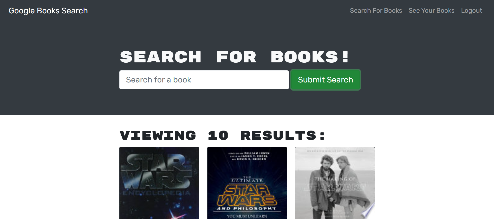

# BookFinder

  
  
## Description
This is the final challenge for my Coding bootcamp journey. For this challenge, we had to follow acceptance criteria to refactor a restful api from starter code into a `GrapQL` api. This project utilizes `JSWT` for user authentication. `Apollo Server` & `Apollo Client` were used to connect the api from the server to the client. `React` was used for the front-end and `Mongo Atlas` was used for the database.
  
TODO: 

The localstorage on the savedbooks page is working but not perfectly. You have to refresh to page for the dom to update. Working on a fix.
  
  
## Table of Contents
* [Description](#description)
* [Usage](#usage)
* [Questions](#questions)
  
## Usage

Below is an example screenshot of the working application. You can view it deploved [here!](https://bookfinder-1-0-0.herokuapp.com/)

  
## Questions
Any Questions? Please reachout to me at Noahbrown2663@gmail.com
In addition, you can view this project and others on my [GitHub](https://github.com/Noahbrown26)
